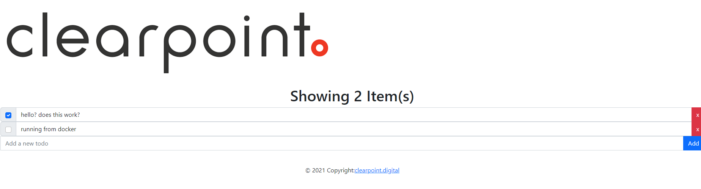

# Developer Assessment

This repository contains code used in the interview process for developers joining the Microsoft Engineering Practice at ClearPoint.

The application is a simple to-do list that allows a user to create items in a list and mark them as complete.
The front end application uses a Microsoft Web API at the backend to facilitate using and persisting items in this to-do list.

The repository includes a **React-based** as well as an **Angular-based** front end application. You can choose either of these frameworks to implement your changes.
 

You are required to make changes to **both** the front end and back end.

**The back end functionality requires the following to be added:**

You are asked to refactor the back end code in this solution. This code is in the Backend folder. You are free to make changes as and where you see fit. Think about how you might structure the solution, add appropriate tests using a framework of your choice, and leave the solution in a more maintainable and more easily understood state than it was originally.

**The front end functionality requires the following to be added:**

1. The ability to surface any errors from the backend API in the UI
2. The ability to mark an item in the to-do list as complete
3. Add unit tests to cover the new functionality using a framework of your choice

Remember that maintainability and clarity is key in your solution.
You are welcome to use comments in the code to outline any assumptions you might make and/or outline your thinking at various points.
Once completed please push the completed solution to your own repo and send us the link.
  
We look forward to seeing your submission and have fun!

# Akrams rundown

## How to run this project

1. Run npm install in the Frontend-react project to install dependencies
2. from the root directory run `docker compose -f "compose.yaml" up --build`
3. This will run the backend and front-end project and build a network for them to connect
    - check the logs, it may take a while for the front-end project to spin up
4. This exposes port :3000 as well so you can launch the front-end from your local machine

## Functionality

1. Automatically saving log
    - As long as the server is running items are persisted to the in-memory database, you can safely leave the page and come back
2. Seamless task updates. No need to save modified tasks they will automatically persist after 1500 milliseconds
3. Seamless addition. Adding new things right where you need them
4. Buttonless. Adding new items can be done with the enter key

